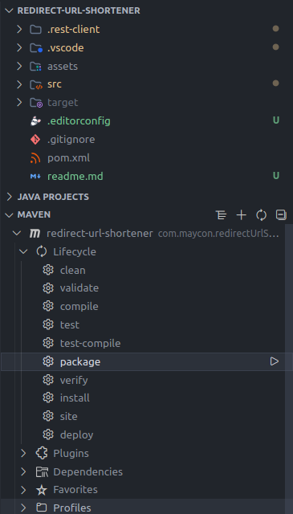

# Redirect Url Shortener

[](https://www.java.com/pt-BR/)
[](https://aws.amazon.com/pt/lambda/)
[](https://aws.amazon.com/pt/s3/)
[](https://aws.amazon.com/pt/api-gateway/)
[](https://aws.amazon.com/pt/cloudwatch/)

### summary

- [Sobre](#sobre)
- [Funcionalidade](#Funcionalidade)
- [Tecnologias utilizadas](#tecnologias-utilizadas)
- [Criar projeto java pelo vscode](#criar-projeto-java-pelo-vscode)
- [Build](#build-do-projeto)

___

## Sobre

Este é um projeto de uma aplicação Lambda em Java que utiliza o AWS SDK para interagir com o serviço S3. A aplicação implementa um handler de requisições.

### Funcionalidade:

A aplicação é projetada para lidar com requisições que contêm um parâmetro de caminho (path) e utiliza esse parâmetro para realizar uma operação no serviço S3. A aplicação verifica se o parâmetro de caminho é válido e, se for, realiza a operação correspondente no S3.

### Tecnologias utilizadas:

- Java 17
- AWS SDK
- AWS Lambda
- S3

___

## Criar projeto java pelo vscode

### Instale as Extensões Necessárias:
1. **Extension Pack for Java** (inclui suporte ao Java, Maven, Spring, etc.).
2. **Debugger for Java** (separado, caso não venha com o pack).

#### Criar um Projeto Java:
1. Pressione Ctrl+Shift+P e escolha Java: Create Java Project.
2. Escolha No Build Tools para um projeto simples ou Maven/Gradle para projetos mais estruturados.
3. Escolha um diretório para o projeto.
4. O VS Code criará a estrutura básica do projeto com pastas como src e um arquivo Main.java.

### Extrutura de pastas:
```
Projeto/
├── .rest-client/
│   └── api.http
├── .vscode/
│   └── extensions.json
│   └── lauch.json
│   └── settings.json
├── assets/
├── src/
│   └── main
│       └── java
│           └── com
│               └── maycon
│                   └── redirectUrlShortener
│                       └── Main.java
│                       └── UrlData.java
├── target/
├── .gitignore
├── pom.xml
├── readme.md
```

### Build do projeto:
```
MAVEN -> Lifecycle -> package
```


___

### Executa o Arquivo `.jar`
```sh
java -jar target/redirect-url-shortener-1.0-SNAPSHOT.jar
```
